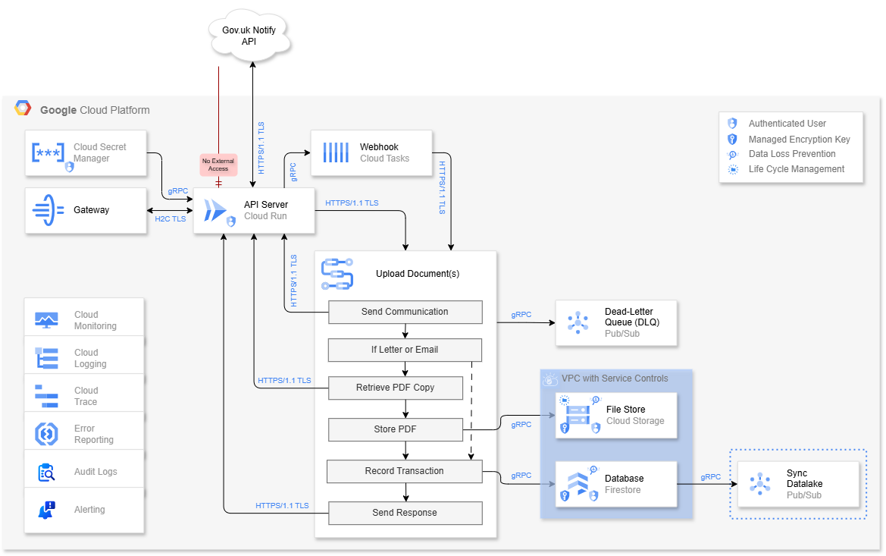

# Communication and Audit Platform

A cloud-native, centralised communication platform built on Google Cloud Platform, designed for local government. Provides a single, reusable integration point for all council systems to send SMS, email, and letter communications via Gov.uk Notify — removing the need for each system to implement its own messaging solution.

Built with two delivery modes: **synchronous** (direct response) and **asynchronous** (webhook callback), making it suitable for both user-facing and system-generated communication workflows.

---

## Architecture Overview



---

## Design Philosophy

### Central, Plug-and-Play Communication
Rather than every council system independently integrating with a messaging provider, this platform acts as a shared communication layer. When systems are replaced or onboarded, they simply reconnect to this platform — no communication logic needs to be rebuilt.

### Two Delivery Routes
The platform supports two distinct use cases in a single service:

| Route | Use Case | How it works |
|---|---|---|
| **Synchronous** | User-facing requests that need an immediate response | API Server processes the workflow and returns the result directly |
| **Asynchronous** | System-generated requests where a callback is preferred | Caller provides a `return_url` in the request body; the response is queued in Cloud Tasks and delivered when the service is less busy |

This covers the full range of council system needs — from a citizen submitting a form and waiting for confirmation, to a back-office system batch-dispatching notifications overnight.

---

## Request Flow

```
External System / User
        │
        ▼ HTTPS 1.1 / TLS
    Gateway
        │
        │ HTTP/2 (H2C) / TLS
        ▼
  API Server (Cloud Run)  ◄── No External Access
        │
        ├── Sync route  ──────────────────────────────────────────────┐
        │                                                             │
        └── Async route (return_url provided)                         │
                  │                                                   │
                  ▼                                                   │
           Webhook (Cloud Tasks)                                      │
                  │                                                   │
                  ▼ HTTPS 1.1 / TLS (when less busy)                  │
        ┌─────────────────────────────────────────────────────────┐   │
        │             Upload Document(s) Workflow                 │   │
        │                                                         │   │
        │  1. Send Communication ──────────────────────────────── │───┼──► DLQ (on failure)
        │  2. If Letter or Email:                                 │   │
        │     a. Retrieve PDF copy from Gov.uk Notify             │   │
        │     b. Store PDF ──────────────────────────────────────►│───┼──► File Store (Cloud Storage)
        │     c. Return file link                                 │   │
        │  3. Record Transaction ───────────────────────────────► │───┼──► Database (Firestore)
        │  4. Send Response                                       │   │
        └─────────────────────────────────────────────────────────┘   │
                  │                                                   │
                  └───────────────────────────────────────────────────┘
                                        │
                              Response returned to
                            origin system / user
```

---

## Components

### Gateway
- Single entry point for all external traffic
- Converts **HTTPS 1.1 → HTTP/2 (H2C)** and vice versa
- Enforces that the API Server has **no direct external access**
- Provides a consistent, secure perimeter for all council system integrations

---

### API Server — Cloud Run (GoLang)
- Written in **GoLang** — optimal for cloud-native, high-throughput services
- **Minimum instances: 0** — this service is not mission-critical and can tolerate cold starts; keeping min instances at 0 reduces cost for a platform that may not see continuous traffic
- Receives communication requests and orchestrates the workflow
- Determines routing: direct (sync) or queued (async) based on presence of `return_url` in the request body
- Returns file links (Cloud Storage URLs) to the origin system in the response, so calling systems have their own reference to the stored communication
- Credentials and Gov.uk Notify API keys managed via **Cloud Secret Manager** — no hardcoded keys, easy rotation

---

### Webhook — Cloud Tasks (Async Route)
- Activated when the caller includes a `return_url` in the request body
- The request is enqueued and processed **when the service is less busy**, reducing load spikes
- Delivers the callback to the specified `return_url` once the communication workflow completes
- Suitable for system-generated bulk or batch communication dispatches
- Retry logic is built into Cloud Tasks — transient failures are retried automatically before escalating to the DLQ

---

### Upload Document(s) Workflow

The core communication workflow, triggered by the API Server for both sync and async routes:

| Step | Action |
|---|---|
| 1 | **Send Communication** — dispatches SMS, email, or letter via Gov.uk Notify API (HTTPS 1.1 / TLS) |
| 2 | **If Letter or Email** — retrieves a PDF copy from Gov.uk Notify (Gov.uk Notify retains copies for 7 days only) |
| 3 | **Store PDF** — persists the PDF to Cloud Storage (File Store) for long-term retention in line with data retention policy |
| 4 | **Record Transaction** — writes the communication record and file link(s) to Firestore via gRPC |
| 5 | **Send Response** — returns the outcome and file link(s) to the API Server, which forwards to the origin system |

> **Why store the PDF?** Gov.uk Notify only retains communication copies for 7 days. Long-term storage is required for audit, compliance, and data retention obligations. Returning the file link in the response also means calling systems can store a reference for their own records without needing to re-query this platform.

> **SMS** — no PDF is generated; the message content and metadata are stored directly in the Firestore record.

---

### Gov.uk Notify API
- External managed service for sending SMS, email, and letters on behalf of the council
- Integrated via HTTPS 1.1 / TLS
- The platform is designed so the message broker can be swapped out or extended — the API Server abstracts the provider. In practice, Gov.uk Notify is the standard for UK public sector; alternative providers would need to support equivalent send + retrieve-copy capabilities to be a like-for-like replacement
- API credentials stored in Cloud Secret Manager

---

### File Store — Cloud Storage
- Stores PDF copies of all letter and email communications
- Organised into **folder-level IAM-controlled directories per service/team** within a single bucket — only the relevant service or team can access their own communications
- **Cross-region replication** configured for disaster recovery
- **Lifecycle Management** enforces automated data retention policies — older files are transitioned to cheaper storage tiers or deleted in line with retention schedules, reducing storage cost over time
- **Google-managed encryption keys** at rest
- **Data Loss Prevention (DLP)** — protects sensitive content within stored documents

---

### Database — Firestore
- Stores communication transaction records: metadata, status, file links, and SMS message content
- Flexible document model suits the variable structure of different communication types (SMS vs email vs letter)
- **Cross-region replication** for disaster recovery
- **Google-managed encryption keys** at rest
- **Data Loss Prevention (DLP)** on stored records
- Contained within **VPC with Service Controls** — prevents data exfiltration
- Synced to the **Datalake (Pub/Sub)** for business intelligence and stakeholder reporting

---

### Dead-Letter Queue (DLQ) — Pub/Sub
- Captures any communication that has exhausted all retry attempts
- **Alert threshold: 0** — a single message entering the DLQ triggers an immediate alert, adjustable based on agreed SLO levels
- Ensures no communication is silently lost — every failure is captured for investigation and reprocessing
- Allows engineering teams to diagnose failures without data loss

---

### Sync Datalake — Pub/Sub
- Streams communication transaction records to the data lake
- Enables council stakeholders to report on communication volumes, delivery rates, and channel usage
- Decoupled from the main request path — does not affect response latency

---

## Compliance

### GDPR — General Data Protection Regulation

This platform processes personal data (names, addresses, contact details) on behalf of the council as a data controller.

| Requirement | Implementation |
|---|---|
| Data minimisation | Only data necessary to send the communication is processed and stored |
| Retention & erasure | Lifecycle Management on Cloud Storage automates retention and deletion; TTL configurable on Firestore records |
| Data protection by design | DLP on Cloud Storage and Firestore; encryption at rest and in transit across all services |
| Audit trail | Firestore transaction records and Cloud Audit Logs provide a full, immutable record of every communication sent |
| Lawful basis | Communications sent on behalf of council services — lawful basis (public task / legal obligation) is the responsibility of the originating system |
| Breach detection | Cloud Monitoring and Alerting detect anomalous access patterns; DLQ alerting captures processing failures immediately |
| Data transfer | VPC Service Controls prevent data leaving defined boundaries; all storage is region-pinned |

---

### Data Sovereignty

| Requirement | Implementation |
|---|---|
| Data residency | All GCP services (Cloud Run, Firestore, Cloud Storage, Pub/Sub) are deployed to UK regions (`europe-west2`) |
| Cross-region replica | Configured within UK-approved region pairs only |
| Boundary enforcement | VPC Service Controls prevent data exfiltration even by internal services |
| Audit | Cloud Audit Logs record all data access with identity and origin |

> Gov.uk Notify is a UK government-operated service (Cabinet Office / GDS). Data sent to Gov.uk Notify is processed within the UK. Confirm with your DPO that the Gov.uk Notify data processing agreement covers your specific use case.

---

### SOC 2 — Service Organisation Control 2

| Trust Criteria | Implementation |
|---|---|
| **Security** | IAM least-privilege across all services; Secret Manager for credentials; VPC isolation of data layer; no external access to API Server |
| **Availability** | Cloud Run scales on demand; Cloud Tasks queues requests during load spikes; cross-region replication on Firestore and Cloud Storage; DLQ prevents silent failures |
| **Confidentiality** | Encryption at rest (Google-managed keys); TLS/gRPC in transit; DLP on stored files and records; folder-level IAM on Cloud Storage |
| **Processing integrity** | Workflow steps are sequential and audited; DLQ captures failures; Firestore transaction records provide end-to-end traceability |
| **Change management** | Terraform for all infrastructure changes (version controlled, reviewed); Cloud Build and Cloud Deploy enforce auditable CI/CD pipeline |
| **Monitoring** | Cloud Monitoring, Logging, Trace, Error Reporting, Audit Logs, and Alerting provide continuous observability |

---

### GDS — Government Design System & GOV.UK Service Standards

As a platform serving UK local government and integrating with Gov.uk Notify, the following GDS standards are relevant:

| Standard | Implementation |
|---|---|
| **GOV.UK Notify usage** | Communications sent via the official government Notify service — consistent, accessible, and GDS-approved templates |
| **Accessibility (WCAG 2.2 AA)** | Letters and emails generated via Gov.uk Notify use GDS-approved templates which meet WCAG 2.2 AA by default. Any custom template content is the responsibility of the originating service |
| **Service Standard Point 5 — Make sure everyone can use the service** | Channel flexibility (SMS, email, letter) ensures communications are accessible to users regardless of digital access |
| **Service Standard Point 10 — Define what success looks like** | Datalake sync enables delivery rate, channel usage, and failure rate reporting for service teams and stakeholders |
| **Service Standard Point 11 — Choose the right tools and technology** | GCP-native stack, Gov.uk Notify, and open standards (gRPC, HTTPS, YAML) align with GDS technology guidance |
| **Data retention** | Communication records retained in line with council retention schedules — consistent with the Local Government Classification Scheme (LGCS) |

> Template content and communication copy remain the responsibility of each originating service. This platform is a delivery and audit layer, not a content management system.

---

## Security

| Layer | Control |
|---|---|
| Network perimeter | Gateway enforces all external access; Cloud Run has no public exposure |
| Secrets management | Cloud Secret Manager — Gov.uk Notify API keys and credentials, no hardcoded values |
| Identity & access | IAM roles enforced across all GCP resources; folder-level IAM per service/team in Cloud Storage |
| Data encryption | Google-managed encryption keys on Firestore and Cloud Storage |
| Data protection | DLP on Cloud Storage and Firestore |
| Retention | Lifecycle Management on Cloud Storage; configurable TTL on Firestore |
| Network isolation | VPC with Service Controls around Firestore and Cloud Storage |
| Transport security | HTTPS 1.1/TLS (external), HTTP/2 H2C/TLS (Gateway → Cloud Run), gRPC (internal service calls) |

---

## Protocols

| Protocol | Used Between |
|---|---|
| HTTPS 1.1 / TLS | External systems ↔ Gateway; API Server ↔ Gov.uk Notify; Webhook callbacks ↔ return_url |
| HTTP/2 (H2C) / TLS | Gateway ↔ Cloud Run API Server |
| gRPC | Cloud Run ↔ Firestore, Cloud Storage, Pub/Sub, Cloud Tasks |

---

## Observability

| Tool | Purpose |
|---|---|
| Cloud Monitoring | Metrics, dashboards, uptime checks |
| Cloud Logging | Centralised structured log ingestion |
| Cloud Trace | Distributed tracing — follow a communication request end-to-end |
| Error Reporting | Automatic error aggregation and alerting |
| Audit Logs | Immutable record of all admin and data access activity |
| Alerting | DLQ alert at threshold 0; adjustable per agreed SLO |

---

## Technology Choices — Rationale

| Technology | Rationale |
|---|---|
| **GoLang** | Cloud-native performance, low memory footprint, high concurrency, native gRPC support |
| **Cloud Run (min 0)** | Not mission-critical; cold starts are tolerable; min 0 instances reduces cost for a shared platform with variable demand |
| **Cloud Tasks** | Managed async queue with built-in retries and rate control; ideal for webhook callback delivery without overloading downstream systems |
| **Firestore** | Flexible document model suits variable communication record structures; low-latency; native GCP integration |
| **Cloud Storage** | Cost-effective, durable blob storage for PDF copies; lifecycle management keeps long-term costs under control |
| **Gov.uk Notify** | GDS-approved, UK government standard for public sector communications; handles delivery, accessibility, and template compliance |
| **gRPC** | Binary protocol, strongly typed, faster than REST for internal service communication |
| **YAML (Workflows)** | Human-readable, supports conditional logic (letter/email vs SMS branching), easy to version control and review |

---

## CI/CD Pipeline

| Tool | Role |
|---|---|
| **Cloud Build** | Triggered on commits — runs tests, linting, and builds container images |
| **Artifact Registry** | Stores and versions built container images securely |
| **Cloud Deploy** | Progressive delivery to environments (dev → staging → production) with approval gates |

```
Git Push
   │
   ▼
Cloud Build ──► Test & Build ──► Push image to Artifact Registry
                                          │
                                          ▼
                                   Cloud Deploy
                                          │
                          ┌───────────────┼───────────────┐
                          ▼               ▼               ▼
                         Dev          Staging         Production
```

---

## Infrastructure as Code — Terraform

All GCP infrastructure is defined and managed in Terraform:

```
infrastructure/
├── environments/
│   ├── dev/
│   ├── staging/
│   └── production/
├── modules/
│   ├── api/              # Cloud Run, Secret Manager
│   ├── async/            # Cloud Tasks, DLQ Pub/Sub
│   ├── storage/          # Cloud Storage (File Store), IAM bindings
│   ├── database/         # Firestore, cross-region config
│   ├── messaging/        # Sync Datalake Pub/Sub
│   ├── networking/       # VPC, Service Controls, Gateway
│   └── observability/    # Monitoring, Logging, Alerting, Trace
└── main.tf
```

---

## Repository Structure

```
/
├── api/                  # GoLang API server (Cloud Run)
├── workflows/            # YAML workflow definitions
├── infrastructure/       # Terraform — all GCP resources
├── cloudbuild.yaml       # Cloud Build pipeline definition
├── docs/
│   └── architecture.png  # Architecture diagram
└── README.md
```

---

## Licence

MIT License

Copyright (c) 2026 Elliott Griffiths

Permission is hereby granted, free of charge, to any person obtaining a copy
of this software and associated documentation files (the "Software"), to deal
in the Software without restriction, including without limitation the rights
to use, copy, modify, merge, publish, distribute, sublicense, and/or sell
copies of the Software, and to permit persons to whom the Software is
furnished to do so, subject to the following conditions:

The above copyright notice and this permission notice shall be included in all
copies or substantial portions of the Software.

THE SOFTWARE IS PROVIDED "AS IS", WITHOUT WARRANTY OF ANY KIND, EXPRESS OR
IMPLIED, INCLUDING BUT NOT LIMITED TO THE WARRANTIES OF MERCHANTABILITY,
FITNESS FOR A PARTICULAR PURPOSE AND NONINFRINGEMENT. IN NO EVENT SHALL THE
AUTHORS OR COPYRIGHT HOLDERS BE LIABLE FOR ANY CLAIM, DAMAGES OR OTHER
LIABILITY, WHETHER IN AN ACTION OF CONTRACT, TORT OR OTHERWISE, ARISING FROM,
OUT OF OR IN CONNECTION WITH THE SOFTWARE OR THE USE OR OTHER DEALINGS IN THE
SOFTWARE.
